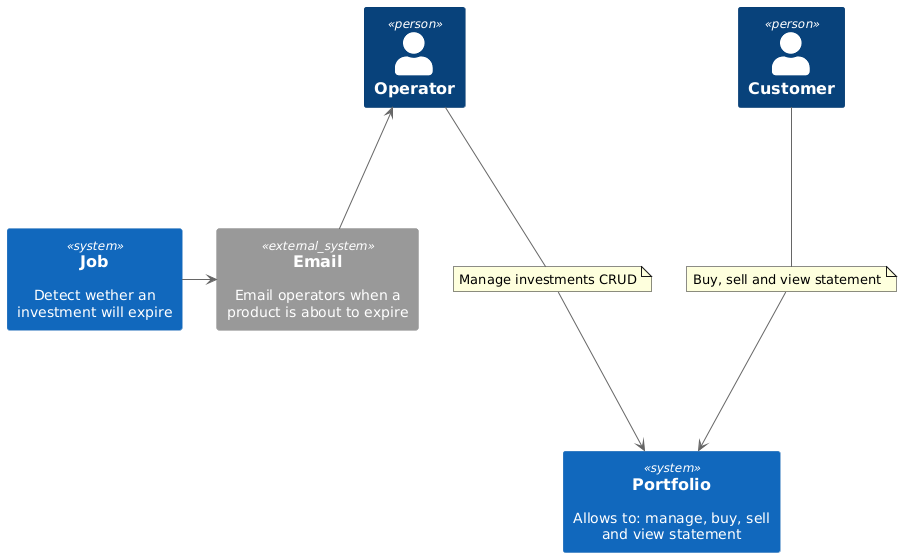
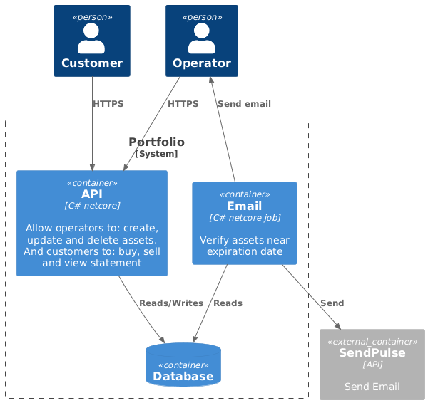

# README

## Arquitetura
O projeto foi idealizado sobre o modelo **clean architecture** e esta dividido da seguinte forma:

### Contexto

### Containers

- portfolio - API
  - docs - diagramas plantuml
  - UseCases - Contem todas as regras de negocio.
  - Entities - Entidades da app
  - DTO - Objetos especificos da api
- portofio.Job - Pensando para ser um Job no K8s
- portfolio.Tests - Testes

Usa Mongo como banco de dados

Todas as pesquisas foram pensadas para utilizar ID visando minimizar qualquer problema de performance no banco de dados e permitir uma baixa latencia.

Para simular um controle de acesso sera necessario passar headers como:
name: *nome_usuario*
type: *tipo_do_usuario* podendo ser Customer ou Operator.

## Dependencias
Este projeto necessita dos seguintes softwares:

- MAKE TOOLS
- PODMAN
- PLANTUML
  - para visualizacao dos diagramas dentro da pasta docs
- DOTNET SDK8

## Run

### Make
Com todas as depencias satisfeitas basta abrir um terminal e rodar o comando: make.

O caminho para o swagger doc deve ser:
http://localhost:5000/swagger/index.html

Se quiser importar em alguma ferramenta como insomnia ou postman:
http://localhost:5000/swagger/v1/swagger.json

### Parando
Se quiser parar e remover os containers digite: **make clean**

